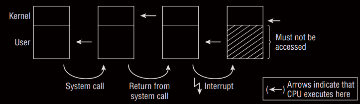
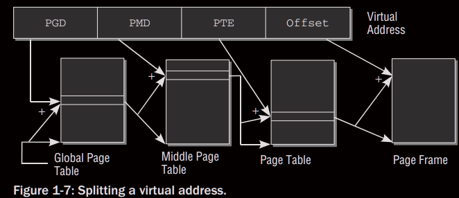
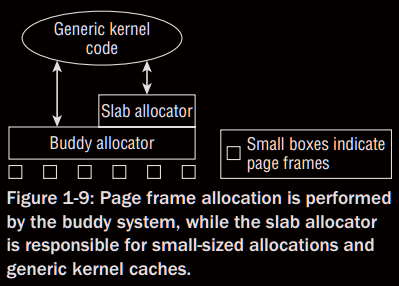
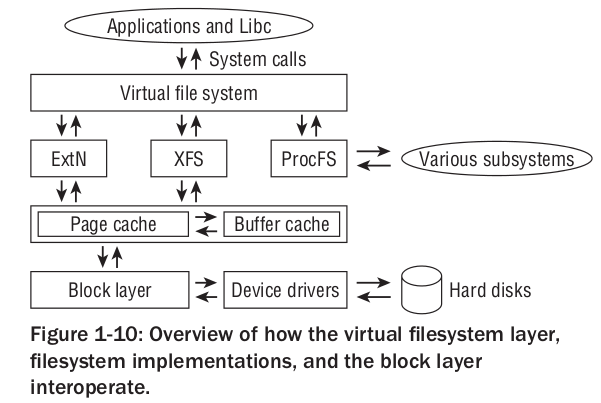

## Elements of the Kernel

### Namespace:

- what is "namespace" ?

	During the development of kernel 2.6, support for namespaces was integrated into numerous subsystems.
	This allows different processes to have different views of the system. Traditionally, Linux (andUnixin
	general) use numerous global quantities, for instance, process identifiers: Every process in the system is
	equipped with a unique identifier (ID), and this ID can be employed by users (or other processes) to refer
	to the process — by sending it a signal, for instance. With namespaces, formerly global resources are
	grouped differently: Every namespace can contain a specific set of PIDs, or can provide different views
	of the filesystem, where mounts in one namespace do not propagate into different namespaces.
	Namespaces are useful; for example, they are beneficial for hosting providers: Instead of setting up
	one physical machine per customer, they can instead usecontainersimplemented with namespaces to
	create multiple views of the system where each seems to be a complete Linux installation from within
	the container and does not interact with other containers: They are separated and segregated from each
	other. Every instance looks like a single machine running Linux, but in fact, many such instances can
	operate simultaneously on a physical machine. This helps use resources more effectively. In contrast to
	full virtualization solutions like KVM, only a single kernel needs to run on the machine and is responsible
	to manage all containers.
	Not all parts of the kernel are yet fully aware of namespaces, and I will discuss to what extent support is
	available when we analyze the various subsystems.

### Address Spaces and Privilege Levels

- All modern CPUs offer several privilege levels in which processes can
reside.
	

#### Virtual and Physical Address Spaces

- 	Physical pages are often calledpage frames. 
	In contrast, the term pageis reserved for pages in virtual address space.
- 	Not all pages of the virtual address spaces are linked with a page frame.
- 	Finally, notice that there are two equivalent terms to address 
	the applications that run on behalf of the user. One of them is **userland**, and this is the nomenclature typically preferred by the BSD community for all things that do not belong to the kernel. The alternative is to say that an application runs in **userspace**. 
	It should be noted that the termuserlandwill always mean applications as such, whereas the term userspace can additionally not only denote applications, but also the portion of the virtual address space in which they are executed, in contrast to kernel space.

### Page Tables

-	PGD is used as an index in an array that exists exactly once for each process.
	
-	A particular feature of page tables is that no page middle tables or page tables
	need be created for areas of virtual address space that are not needed. 
	This saves a great deal of RAM as compared to the single-array method.
-	A special part of the CPU known as a memory management unit(**MMU**) is optimized to perform referencing operations.
-	The addresses that occur most frequently in address translation are held in a fast CPU cache called a Translation Lookaside Buffer(**TLB**). 
	Translation is accelerated because the address data in the cache are immediately available without needing to access the page tables and therefore the RAM.
-	The architecture-independent part of the kernel always **assumes** a **four-level**
page table.
-	**Memory Mappings** are also used directly in the kernel when implementing device drivers.

### Allocation of Physical Memory

#### The Buddy System

Free memory blocks in the system are always grouped as two buddies. The buddies can be allocated independently of each other; if, however, both remain unused at the same time, the kernel merges them into a larger pair that serves as a buddy on the next level.

#### The Slab Cache

the overhead of the slab allocator may be too much for really tiny embedded systems.

#### Swapping and Page Reclaim

###Timing 

It is possible to make the periodic tick **dynamic**. When there is little to do and no need for frequent periodic actions, it does not make sense to periodically generate timer interrupts that prevent the processor from powering down into deep sleep states. This is helpful in systems where power is scarce, for instance, laptops and embedded systems.

### System Calls

Enabling user processes to interact with the kernel POSIX standard defines a number of system calls and theireffect as implemented on all POSIX-compliant systems including Linux.

eg: Process Management, Signals, Files, Directories and Filesystem, Protection Mechanisms, Timer Functions.

When a system call is issued, the processor must change the privilege level and switch from user mode to system mode. There is no standardized way of doing this in Linux as each hardware platform offers specific mechanisms 

### Device Drivers, Block and Character Devices

"**everything is a file**" : using device files that usually reside in the `/dev` directory and can be processed by programs in the same way as regular files.

Peripheral devices belong to one of the following two groups:

1. Character Devices

	random access is not possible

2. Block Devices

	Allow applications to address their data randomly and to freely select the position at which they want to read data.

Typical block devices are hard disks because applications can address any position on the disk from which to read data.

Extensive caching mechanisms are used to boost system performance

### Networks

Linux uses **sockets** from the BSD world; these act as *agents* between the application, file interface, and network implementation of the kernel.

### Filesystems

eg: Ext2 and Ext3, ReiserFS, XFS, VFAT.

- Ext2 is based on inodes 
 
VFS (virtual filesystemorvirtual filesystem switch) acts as an interface downward (this interface must be implemented by all filesystems) and upward (for system calls via which user processes are ultimately able to access filesystem functions)

### Modules and Hotplugging

Modules are used to dynamically add functionality to the kernel at run time — device drivers, filesystems, network protocols, practically any subsystem of the kernel can be modularized.

	Basically, modules are simply normal programs that execute in kernel space rather than in userspace.

### List Handling

list handling API - [list-example](list-example)

Even if there is only one list element in the structure, this entry is used to find the correct start address of the instance by means of
pointer arithmetic; the address is translated into the required data type by means of type conversion.

### Object Management and Reference Counting

Use generic kernel object mechanism to :

- Reference Counting
- Managementof lists of object
- Locking of sets
- Exporting object properties into userspace (via `sysfs` filesystem)

kernel object API - [kernel-object](kernel-object)