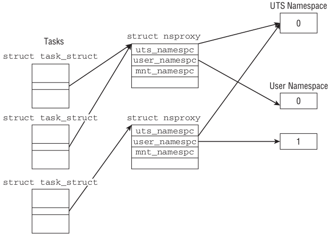
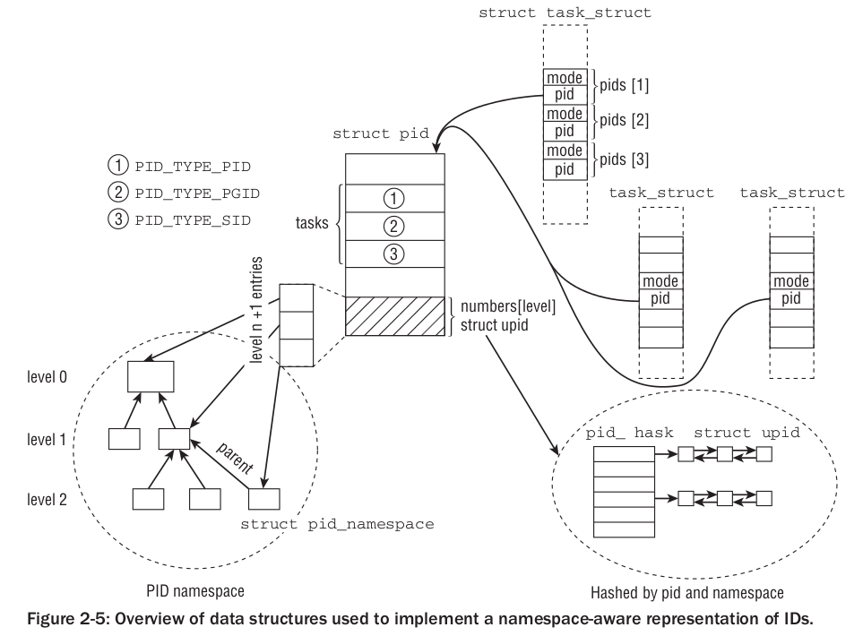

# Process Management and Scheduling

To support *multitasking*, the kernel need to deal lot of issues, like:

- Applications must not interfere with each others. -> 	Memory Protection

- CPU time shared fairly. -> Scheduling, platfrom-independent

- Make sure the environment is the same as when it last withdrew processor resources. -> 	platfrom-dependent

## Content

- [Process Priorities][Process Priorities]
- [Process Life Cycle][Process Life Cycle]
	- [Preemptive Multitasking][Preemptive Multitasking]
- [Process Representation][Process Representation]
	- [Process Types][Process Types]
	- [Namespaces][Namespaces]
		- [Introduction][Introduction]
		- [Implementation][Implementation]
			- [UTS namespaces][UTS namespaces]
			- [User Namespace][User Namespace]
	- [Process Indentification Number][Process Indentification Number]
		- [Managing PIDs][Managing PIDs]
		- [Overview Of Namespace][Overview Of Namespace]

## Process Priorities

[Process Priorities]: #process-priorities

At least, we can devide the processes into :

- Real-time process (Hard/Soft)
	
	- Linux does not support hard real-time processing, at least not in the vanilla kernel.
	- An example of a soft real-time process is a write operation to a CD. Data must be received by the CD writer at a **certain rate** because data are written to the medium in a continuous stream. If system loading is too high, the data stream may be interrupted briefly, and this may result in an unusable CD, far less drastic than a plane crash(hard real-time process). Nevertheless, the write process should always be granted CPU time when needed — before all other normal processes.

- Non-Real-time process(normal processes)

	- Assigning priorities to them
	- For example, a long compiler run or numerical calculations need only very low priority because it is of **little consequence** if computation is interrupted occasionally for a second or two — users are unlikely to notice. In contrast, **interactive applications** should respond as quickly as possible to user commands because users are notoriously impatient.

Classify with scheme:

- non-preemptive multitasking

	Its runtime environment should be saved so that results are not lost and the process environment is fully reinstated when its turn comes around again. (essentially, the contents of all CPU registers and the page tables).

	The structure of Linux process management requires two further process state options — **user** mode and **kernel** mode. These reflect the fact that all modern CPUs have (at least) two different execution modes, one of which has unlimited rights while the other is subject to various restrictions.

	Normally the kernel is in user mode in which it may access only its own data and cannot therefore inter- fere with other applications in the system — it usually doesn’t even notice that there are other programs besides itself.

- preemptive multitasking

The scheduler code has seen two complete rewrites in recent years:

- O(1) scheduler

	One particular property of this scheduler was that it could perform its work in constant time independent of the number of processes that were running on a system.

- completely fair scheduler

## Process Life Cycle

[Process Life Cycle]: #process-life-cycle

Key idea : A process is not always ready to run.

A process may have one of the following states : 'running', 'waiting', 'sleeping', 'zombie'
.

- 'zombie' : 

	As the name suggests, such processes are defunct but are somehow still alive. In reality, they are dead because their resources (RAM, connections to peripherals, etc.) have already been released so that they cannot and never will run again. However, they are still alive because there are still entries for them in the **process table**.

	How do zombies come about? The reason lies in the process creation and destruction structure under Unix. A program terminates when two events occur — first, the program must be killed by another process or by a user (this is usually done by sending a **`SIGTERM`** or **`SIGKILL`** **signal**, which is equivalent to terminating the process regularly); second, the parent process from which the process originates **must** invoke or have already invoked the **`wait4`** (read: wait for) system call when the child process terminates. This confirms to the kernel that the parent process has acknowledged the death of the child. The system call enables the kernel to free resources reserved by the child process.

	A zombie occurs when only the first condition (the program is terminated) applies but not the second ( `wait4` ). A process always switches briefly to the zombie state between termination and removal of its data from the process table. In some cases (if, e.g., the parent process is badly programmed and does not issue a wait call), a zombie can firmly lodge itself in the process table and remain there **until the next reboot**. This can be seen by reading the output of process tools such as ps or top . This is hardly a problem as the residual data take up little space in the kernel.

The system saves all processes in a process table — regardless their states.

### Preemptive Multitasking
[Preemptive Multitasking]: #preemptive-multitasking
If a process wants to access system data or functions (the latter manage the resources shared between all processes, e.g., filesystem space), it must switch to **kernel** mode. Methods:

- **System Call**
- **Interrupt**

The preemptive scheduling model of the kernel establishes a hierarchy that determines which process states may be interrupted by which other states.

Priority: (From Low to High)

1. Normal Process
2. Processing a system call

	One option known as kernel preemption (kernel 2.5) supports switches to another process, if this is urgently required, even during the execution of system calls in kernel mode (but not during interrupts), because the time for processing a system call may be too long for some applications that are reliant on constant data streams

3. Processing a interrupt

## Process Representation

[Process Representation]: #process-representation

All algorithms of the Linux kernel concerned with processes and programs are built around a data structure named `task_struct` and defined in `include/sched.h`. Disscss [here](sched).

### Process Types

[Process Types]: #process-types

The processes are generated using the `fork`, `exec`, `clone` system calls:

- `fork` : copy the current process as *child process*. 

	All resources are copied(memory data, open files, working directory)

- `exec` : using current process to running another process
- `clone` : it's used to implement **thread**

### Namespaces

[Namespaces]: #namespaces

What is **namespace**? If a compnay provide IaaS, it wants to provide lots of custumer for each hardware. There are methods like vitualization. Each user is in their own kernel. **Namespaces** is another method, by which users share one kernel. 

Namespaces provide a lightweight form of virtualization by allowing us to view the global properties of a running system under different aspects.

[Lwn.net][1] has a introduction:

The Linux 3.8 merge window saw the acceptance of Eric Biederman's sizeable series of user namespace and related patches. Although there remain some details to finish—for example, a number of Linux filesystems are **not** yet user-namespace aware—the implementation of **user namespaces** is now functionally complete.

The completion of the user namespaces work is something of a milestone, for a number of reasons. 

1. 	This work represents the completion of one of the most complex namespace implementations to date, as evidenced by the fact that it has been around five years since the first steps in the implementation of user namespaces (in Linux 2.6.23). 

2. 	The namespace work is currently at something of a "stable point", with the implementation of most of the existing namespaces being more or less complete. This does not mean that work on namespaces has finished: other namespaces may be added in the future, and there will probably be further extensions to existing namespaces, such as the addition of namespace isolation for the kernel log. 

3.	The recent changes in the implementation of user namespaces are something of a game changer in terms of how namespaces can be used: starting with Linux 3.8, *unprivileged processes* can create user namespaces in which they have full privileges, which in turn allows any other type of namespace to be created inside a user namespace. Thus, the present moment seems a good point to take an overview of namespaces and a practical look at the namespace API. 

[1]: http://lwn.net/Articles/531114/

#### Introduction

[Introduction]:#introduction

Currently, Linux implements six different types of namespaces. The purpose of each namespace is to wrap a particular global system resource in an abstraction that makes it appear to the processes within the namespace that they have their own **isolated** instance of the global resource. One of the overall goals of namespaces is to support the implementation of **containers**, a tool for *lightweight virtualization* (as well as other purposes) that provides a group of processes with the illusion that they are the only processes on the system.

In the discussion below, we present the namespaces in the order that they were implemented. The `CLONE_NEW*` identifiers listed in parentheses are the names of the constants used to identify namespace types when employing the namespace-related APIs (`clone()`, `unshare()`, and `setns()`).

-	Mount namespaces (CLONE_NEWNS, Linux 2.4.19) 

	- 	Relative system call : `mount()`, `umount()`
	- 	Each container have own : different views of the filesystem hierarchy

- 	UTS namespaces (CLONE_NEWUTS, Linux 2.6.19) : "UNIX Time-sharing System"
	
	- 	Relative system call : `uname()`, `sethostname()`, `setdomainname()`
	- 	Each container have own : **hostname**, **NIS domain name**.

-	IPC namespaces (CLONE_NEWIPC, Linux 2.6.19) 

	-	Each container have own : System V **IPC identifiers**, POSIX **message queue filesystem**.

-	PID namespaces (CLONE_NEWPID, Linux 2.6.24) 

	-	Each container have own : process ID number space, **init** (PID 1)
	-	Benefits : 

		-	containers can be migrated between hosts while keeping the same process IDs for the processes inside the container.
		-	 the "ancestor of all processes" manages various system initialization tasks and reaps orphaned child processes when they terminate.

	-	A process will have one PID for each of the layers of the hierarchy starting from the PID namespace in which it resides through to the root PID namespace.
	-	A process can see (e.g., view via /proc/PID and send signals with kill()) only processes contained in its own PID namespace and the namespaces nested below that PID namespace.

-	Network namespaces (CLONE_NEWNET, started in Linux 2.4.19 2.6.24 and largely completed by about Linux 2.6.29) 

	-	Each container have own : network devices, IP addresses, IP routing tables, `/proc/net` directory, port numbers, and so on
	-	It is possible to have multiple containerized web servers on the same host system, with each server bound to port 80 in its (per-container) network namespace.

-	User namespaces (CLONE_NEWUSER, started in Linux 2.6.23 and completed in Linux 3.8) 
	
	-	Each container have own : UID, GID
	-	A process can have a normal unprivileged user ID outside a user namespace while at the same time having a user ID of 0 inside the namespace.
	-	Starting in Linux 3.8, unprivileged processes can create user namespaces, which opens up a raft of interesting new possibilities for applications: since an otherwise unprivileged process can hold root privileges inside the user namespace, unprivileged applications now have access to functionality that was formerly limited to root.

#### Implementation

[Implementation]:#implementation



Each kernel subsystem that is aware of namespaces must provide a data structure that collects all objects that must be available on a per-namespace basis. struct **`nsproxy`** is used to collect pointers to the subsystem-specific namespace wrappers:

It can be found in `/include/linux/nsproxy.h`

```c

/*
 * A structure to contain pointers to all per-process
 * namespaces - fs (mount), uts, network, sysvipc, etc.
 *
 * The pid namespace is an exception -- it's accessed using
 * task_active_pid_ns.  The pid namespace here is the
 * namespace that children will use.
 *
 * 'count' is the number of tasks holding a reference.
 * The count for each namespace, then, will be the number
 * of nsproxies pointing to it, not the number of tasks.
 *
 * The nsproxy is shared by tasks which share all namespaces.
 * As soon as a single namespace is cloned or unshared, the
 * nsproxy is copied.
 */
struct nsproxy {
	atomic_t count;
	struct uts_namespace *uts_ns;
	struct ipc_namespace *ipc_ns;
	struct mnt_namespace *mnt_ns;
	struct pid_namespace *pid_ns_for_children;
	struct net *net_ns;
};
```

In `sched.h`, we find `task_struct` has a property `struct nsproxy *nsproxy;`. Because a pointer is used, a collection of sub-namespaces can be shared among multiple processes. This way, changes in a given namespace will be visible in all processes that belong to this namespace.

The initial global namespace is defined by `init_nsproxy` in `nsproxy.c` , which keeps pointers to the initial objects of the per-subsystem namespaces

##### UTS namespaces

[UTS namespaces]:#uts-namespaces

Recall : 

- 	Relative system call : `uname()`, `sethostname()`, `setdomainname()`
- 	Each container have own : **hostname**, **NIS domain name**.

The corresponding code can be found in `utsnae.h`, in which `uts_namespace` is the structure saving releant infromation.

```c
struct uts_namespace {
	struct kref kref;
	struct new_utsname name;
	struct user_namespace *user_ns;
	unsigned int proc_inum;
};

struct new_utsname {
	char sysname[__NEW_UTS_LEN + 1];
	char nodename[__NEW_UTS_LEN + 1];
	char release[__NEW_UTS_LEN + 1];
	char version[__NEW_UTS_LEN + 1];
	char machine[__NEW_UTS_LEN + 1];
	char domainname[__NEW_UTS_LEN + 1];
};
```

We can use `cat /proc/sys/kernel/xxx` to see these values, which is initial settings stored in `init_uts_ns` in `init/version.c`.

```c
struct uts_namespace init_uts_ns = {
	.kref = {
		.refcount	= ATOMIC_INIT(2),
	},
	.name = {
		.sysname	= UTS_SYSNAME,
		.nodename	= UTS_NODENAME,
		.release	= UTS_RELEASE,
		.version	= UTS_VERSION,
		.machine	= UTS_MACHINE,
		.domainname	= UTS_DOMAINNAME,
	},
	.user_ns = &init_user_ns,
	.proc_inum = PROC_UTS_INIT_INO,
};
```

Above constants are set in `utsrelease.h` which is dynamically built by top-level *Makefile*.

Now, question is how to create a new UTS namespace? Information can be found via `man 2 clone`: 
```
	   
	/* Prototype for the glibc wrapper function */

	#include <sched.h>

	int clone(int (*fn)(void *), void *child_stack,
     	int flags, void *arg, ...
     	/* pid_t *ptid, struct user_desc *tls, pid_t *ctid */ );

	/* Prototype for the raw system call */

	long clone(unsigned long flags, void *child_stack,
		void *ptid, void *ctid,
		struct pt_regs *regs);


	CLONE_NEWUTS (since Linux 2.6.19)
	If CLONE_NEWUTS is set, then create the process  in  a  new  UTS
	namespace,  whose identifiers are initialized by duplicating the
	identifiers from the UTS namespace of the calling  process.   If
	this  flag  is  not  set, then (as with fork(2)), the process is
	created in the same UTS namespace as the calling process.   This
	flag is intended for the implementation of containers.

	A  UTS namespace is the set of identifiers returned by uname(2);
	among these, the domain name and the host name can  be  modified
	by  setdomainname(2) and  sethostname(2), respectively.  Changes
	made to the identifiers in a UTS namespace are  visible  to  all
	other  processes  in  the same namespace, but are not visible to
	processes in other UTS namespaces.

	Use of this flag requires: a kernel  configured  with  the  CON‐
	FIG_UTS_NS   option   and   that   the   process  be  privileged
	(CAP_SYS_ADMIN).
```
##### User Namespace

[User Namespace]:#user-namespace

Recall : 
	
-	Each container have own : UID, GID
-	A process can have a normal unprivileged user ID outside a user namespace while at the same time having a user ID of 0 inside the namespace.
-	Starting in Linux 3.8, unprivileged processes can create user namespaces, which opens up a raft of interesting new possibilities for applications: since an otherwise unprivileged process can hold root privileges inside the user namespace, unprivileged applications now have access to functionality that was formerly limited to root.

I found there is no user-namespace related code in `nsproxy.h`, based on *kernel v3.11.10*, but with `user_namespace.h` and `user_namespace.c`.

Therefore, I use below to find the associated files.
	
	find -name '*.h' | xargs grep -l '#include <linux/user_namespace.h>'

Results:

	./include/linux/sock_diag.h
	./include/linux/init_task.h

How to coperate with each others is omitted here temporaity. I read `user_namespace.h` and `user_namespace.c` first.

The user_namespace struct :

```c
struct user_namespace {
	struct uid_gid_map	uid_map;
	struct uid_gid_map	gid_map;
	struct uid_gid_map	projid_map;
	atomic_t		count;
	struct user_namespace	*parent;
	int			level;
	kuid_t			owner;
	kgid_t			group;
	unsigned int		proc_inum;

	/* Register of per-UID persistent keyrings for this namespace */
	#ifdef CONFIG_PERSISTENT_KEYRINGS
		struct key		*persistent_keyring_register;
		struct rw_semaphore	persistent_keyring_register_sem;
	#endif
};
```

### Process Indentification Number

[Process Indentification Number]: #process-identification-number

It's called PID here. However, each process characterized also by other identifiers than PID. Examples:

- *PID* 
	- PID namespaces are organized in a hierarchy.
	- We have to distinguish between **local** and **global** IDs
		- Global IDs : 
			valid within the kernel itself and in the initial namespace to which the `init` tasks started during *boot* belongs.
		- Local IDs :
			belong to a specific namespace and are not globally valid. For each ID type, they are valid within the namespace to which they belong, but identifiers of identical type may appear with the same ID number in a different namespace.
	- `task_struct->pid` 
- *TGID* : thread group ID
	- `task_struct->tgid`
- *PGID* : process group
	- relative *system call* : `setpgrp`
	- Process groups facilitate the sending of signals to all members of the group
	- `task_struct->signal->__pgrp` denoted the global PGID
- *SID* : session ID
	- relative *system call* : `setsid`
	- Several process groups can be combined in a session.
	- It is used in terminal programming 
	- `task_struct->signal->__session` denotes the global SID

Recall the `task_struct` in *sched.h* : 

```c
struct task_struct{
...
	pid_t pid;
	pid_t tgid;
...
}
```

#### Managing PIDs

[Managing PIDs]: #managing-pids

In addition to these two fields(`pid`, `tgid`), the kernel needs to find a way to manage all local per-namespace quantities, as well as the other identifiers like TID and SID. This requires several interconnected data structures and numerous auxiliary functions.

The data structures required to represent IDs themselves is `struct pid_namespace` defined in *linux/pid_namespace.h*.

- souce code

	```c
	struct pid_namespace {
		struct kref kref;
		struct pidmap pidmap[PIDMAP_ENTRIES];
		struct rcu_head rcu;
		int last_pid;
		unsigned int nr_hashed;
		struct task_struct *child_reaper;
		struct kmem_cache *pid_cachep;
		unsigned int level;
		struct pid_namespace *parent;
	#ifdef CONFIG_PROC_FS
		struct vfsmount *proc_mnt;
		struct dentry *proc_self;
	#endif
	#ifdef CONFIG_BSD_PROCESS_ACCT
		struct bsd_acct_struct *bacct;
	#endif
		struct user_namespace *user_ns;
		struct work_struct proc_work;
		kgid_t pid_gid;
		int hide_pid;
		int reboot;	/* group exit code if this pidns was rebooted */
		unsigned int proc_inum;
	};
	```
- `child_reaper` :

	Every PID namespace is equipped with a task that assumes the role taken by `init` in the global picture. One of the purposes of `init` is to call `wait4` for orphaned tasks, and this must likewise be done by the namespace-specific init variant. A pointer to the task structure of this task is stored in `child_reaper`.
- `parent`, `level` : 

	`parent` is pointer to the parent namespace, and `level` denotes the depth in the namespace hierarchy. The initial namespace has level 0. 

	Counting the levels is important because IDs in higher levels must be visible in lower levels. From a given level setting, the kernel can infer how many IDs must be associated with a task.

- Relative files:
	
	I use below	command:

	```bash
	find -name '*.h' | xargs grep -l '#include <linux/pid_namespace.h>'
	```			

	Results:
		
		./include/linux/perf_event.h
		./include/linux/init_task.h

PID management is centered around two data structures in *linux/pid.h*.

- `struct pid`
	
	The kernel-internal representation of a *PID*

	```c
	struct pid
	{
		atomic_t count;
		unsigned int level;
		/* lists of tasks that use this pid */
		struct hlist_head tasks[PIDTYPE_MAX];
		struct rcu_head rcu;
		struct upid numbers[1];
	};	
	```

	The definition of `struct pid` is headed by a reference counter `count` . `tasks` is an array with a *hash list head* for every **ID type**. This is necessary because an ID can be used for several processes. All `task_struct` instances that share a given ID are linked on this list.
- `struct upid`
	
	Store the information that is visible in a specific namespace.

	```c
	struct upid {
		/* Try to keep pid_chain in the same cacheline as nr for find_vpid */
		int nr;
		struct pid_namespace *ns;
		struct hlist_node pid_chain;
	};
	```

	`nr` represents the numerical value of an ID, and `ns` is a pointer to the namespace to which the value belongs. All upid instances are kept on a *hash table*, and `pid_chain` allows for implementing hash overflow lists with standard methods of the kernel. 
- `enum pid_type`

	```c
	enum pid_type
	{
		PIDTYPE_PID,
		PIDTYPE_PGID,
		PIDTYPE_SID,
		PIDTYPE_MAX
	};
	```

#### Overview Of Namespace

[Overview Of Namespace]:#overview-of-namespace



# Linux philosophy:

Since Linux is optimized for throughput and tries to handle common cases as fast as possible, guaranteed response times are only very hard to achieve.