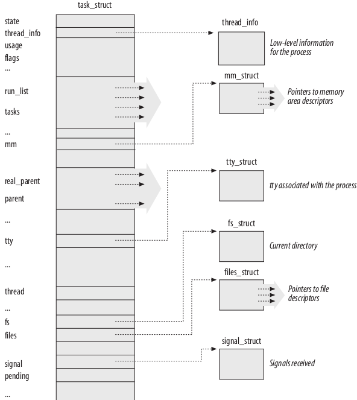

## Contents

`sched.h` can be found in `include/sched.h`: [link](sched.h)

- [task_struct][task_struct]
	- [task state][task state]
	- [nsproxy][nsproxy]
- [Resource limit][Resource limit] 

## task_struct

[task_struct]: #task_struct
In this file, we first read the `task_struct` part.

This code represents a specific aspect of the process:

- State and execution information such as pending signals, binary format used (and any emulation information for binary formats of other systems), process identification number (pid), pointers to parents and other related processes, priorities, and time information on program execution (e.g., CPU time).
- Information on allocated virtual memory.
- Process credentials such as user and group ID, capabilities, 2 and so on. System calls can be used to query (or modify) these data; I deal with these in greater detail when describing the specific subsystems.
- Files used: Not only the binary file with the program code but also filesystem information on all files handled by the process must be saved.
- Thread information, which records the CPU-specific runtime data of the process (the remaining fields in the structure are not dependent on the hardware used).
- Information on interprocess communication required when working with other applications.
- Signal handlers used by the process to respond to incoming signals.
- 

### task state

[task state]:#task-state
- TASK_INTERRUPTIBLE :

	The process is suspended (sleeping) until some **condition** becomes true. Raising a *hardware interrupt*, releasing a system *resource* the process is waiting for, or delivering a *signal* are examples of conditions that might wake up the process (put its state back to **TASK_RUNNING** ).
- TASK_STOPPED:

	Process execution has been stopped; the process enters this state after receiving a *SIGSTOP*, *SIGTSTP*, *SIGTTIN*, or *SIGTTOU* signal.
- TASK_TRACED

	Process execution has been stopped by a debugger. When a process is being mon- itored by another (such as when a debugger executes a `ptrace( )` system call to monitor a test program), each signal may put the process in the *TASK_TRACED* state.
- EXIT_ZOMBIE : 

	As the name suggests, such processes are defunct but are somehow still alive. In reality, they are dead because their resources (RAM, connections to peripherals, etc.) have already been released so that they cannot and never will run again. However, they are still alive because there are still entries for them in the **process table**.

	How do zombies come about? The reason lies in the process creation and destruction structure under Unix. A program terminates when two events occur — first, the program must be killed by another process or by a user (this is usually done by sending a **`SIGTERM`** or **`SIGKILL`** **signal**, which is equivalent to terminating the process regularly); second, the parent process from which the process originates **must** invoke or have already invoked the **`wait4`** (read: wait for) system call when the child process terminates. This confirms to the kernel that the parent process has acknowledged the death of the child. The system call enables the kernel to free resources reserved by the child process.

	A zombie occurs when only the first condition (the program is terminated) applies but not the second ( `wait4` ). A process always switches briefly to the zombie state between termination and removal of its data from the process table. In some cases (if, e.g., the parent process is badly programmed and does not issue a wait call), a zombie can firmly lodge itself in the process table and remain there **until the next reboot**. This can be seen by reading the output of process tools such as ps or top . This is hardly a problem as the residual data take up little space in the kernel.
- EXIT_DEAD

	 the state after an appropriate `wait` system call has been issued and before the task is completely removed from the system. This state is only of importance if multiple threads issue `wait` calls for the same task.
- Constants in *sched.h*
	
	```c
	/*
	 * Task state bitmask. NOTE! These bits are also
	 * encoded in fs/proc/array.c: get_task_state().
	 *
	 * We have two separate sets of flags: task->state
	 * is about runnability, while task->exit_state are
	 * about the task exiting. Confusing, but this way
	 * modifying one set can't modify the other one by
	 * mistake.
	 */
	#define TASK_RUNNING		0
	#define TASK_INTERRUPTIBLE	1
	#define TASK_UNINTERRUPTIBLE	2
	#define __TASK_STOPPED		4
	#define __TASK_TRACED		8
	/* in tsk->exit_state */
	#define EXIT_ZOMBIE		16
	#define EXIT_DEAD		32
	/* in tsk->state again */
	#define TASK_DEAD		64
	#define TASK_WAKEKILL		128
	#define TASK_WAKING		256
	#define TASK_PARKED		512
	#define TASK_STATE_MAX		1024

	#define TASK_STATE_TO_CHAR_STR "RSDTtZXxKWP"
	```

### nsproxy

[nsproxy]:#nsproxy
In `sched.h`, we find `task_struct` has a property `struct nsproxy *nsproxy;`. Because a pointer is used, a collection of sub-namespaces can be shared among multiple processes. This way, changes in a given namespace will be visible in all processes that belong to this namespace.

The initial global namespace is defined by `init_nsproxy` in `nsproxy.c` , which keeps pointers to the initial objects of the per-subsystem namespaces.

More details in [namespace](../namespace).
## Resource limit

[Resource limit]:#resource-limit
Linux provides the resource limit (`rlimit`) mechanism to impose certain system resource usage limits on processes. The mechanism makes use of the `rlim` array in *task_struct* , whose elements are of the struct rlimit type.